# Compiler Glossary

Terms used throughout the Tcl LSP compiler documentation, ordered by
pipeline phase.  See also the [example walkthroughs](design/example-script-walkthroughs.md)
for worked examples of each concept.

---

## Full pipeline

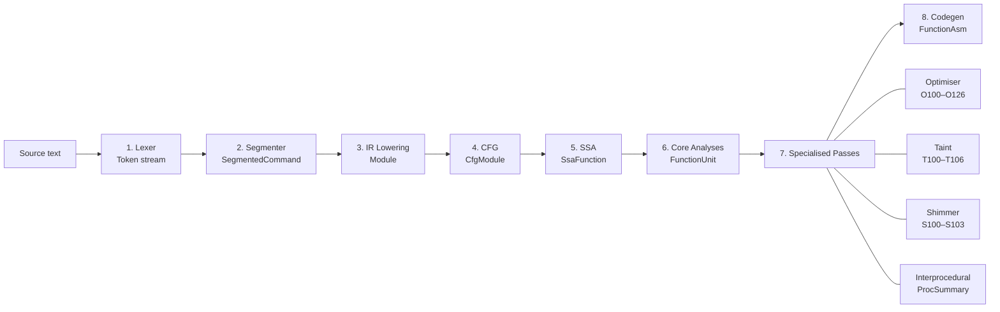

---

## Alphabetic index

[AST](#ast) · [Barrier](#barrier) · [Basic block](#basic-block) · [C extension shim](#c-extension-shim) · [CFG](#cfg) · [Codegen](#codegen) · [Command walk](#command-walk) · [CommandSpec](#commandspec) · [Compilation unit](#compilation-unit) · [Compiled artefact](#compiled-artefact) · [Constant folding](#constant-folding) · [CSE](#cse) · [Data-flow graph](#data-flow-graph) · [DCE](#dce) · [Def-use chains](#def-use-chains) · [dialect](#dialect) · [Dispatch-stability proof](#dispatch-stability-proof) · [Dominance frontier](#dominance-frontier) · [Dominator / idom](#dominator--idom) · [Escape tag](#escape-tag) · [FormSpec](#formspec) · [Frame-only var](#frame-only-var) · [GVN](#gvn) · [ICIP](#icip) · [InstCombine](#instcombine) · [Interpreter domain](#interpreter-domain) · [IPA](#ipa) · [IR](#ir) · [Lattice](#lattice) · [LCP](#lcp) · [Lexing](#lexing) · [LICM](#licm) · [Lifecycle (registry)](#lifecycle-registry) · [Liveness](#liveness) · [Lowering](#lowering) · [LVT](#lvt) · [Memory-SSA](#memory-ssa) · [Native proc entry](#native-proc-entry) · [Pattern recognition](#pattern-recognition) · [Phi node (φ)](#phi-node-φ) · [Rendered-value properties](#rendered-value-properties) · [Requirement straddle](#requirement-straddle) · [salsa](#salsa) · [SCCP](#sccp) · [Shimmer](#shimmer) · [Side-effects](#side-effects) · [Source edge](#source-edge) · [Special variable](#special-variable) · [SSA](#ssa) · [SSA value key](#ssa-value-key) · [Strength reduction](#strength-reduction) · [SubCommand](#subcommand) · [Symbol-definer command](#symbol-definer-command) · [Tail position](#tail-position) · [Tail-call optimisation](#tail-call-optimisation) · [Taint analysis](#taint-analysis) · [Taint colour](#taint-colour) · [Taint sink](#taint-sink) · [Taint source](#taint-source) · [Trace](#trace) · [Type inference](#type-inference) · [Unused procs elimination](#unused-procs-elimination) · [Value provenance](#value-provenance) · [Value transfer](#value-transfer) · [ValueOps](#valueops) · [Var-escape analysis](#var-escape-analysis) · [Version floor](#version-floor) · [World-state contents lattice](#world-state-contents-lattice)

---

## Phase 1 — Parsing

### Lexing

The first pass of the compiler. Turns source text into a stream of
tokens with exact source ranges, handling Tcl's substitution rules
(word expansion, braces, brackets, quotes, backslash escapes). The
lexer is also responsible for preserving the whitespace and range
information every later pass relies on to point diagnostics at the
right character. Implemented by `Lexer` in `tcl_lexer::lexer`.

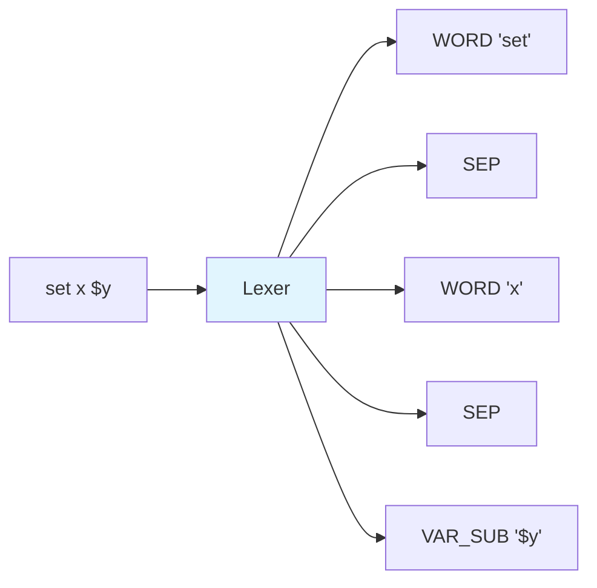

> Every token carries a start and end offset; ranges are the single
> source of truth used by diagnostics, hover, and code actions.

See also: [Lexing and segmentation](design/compiler/lexing-segmentation.md).
KCS tag: `lexing`.

### AST

Abstract Syntax Tree — a tree representation of parsed source code
structure.  In this compiler, expression bodies (`expr {…}`) are parsed
into `ExprNode` AST trees (`tcl_syntax::expr::ast`).

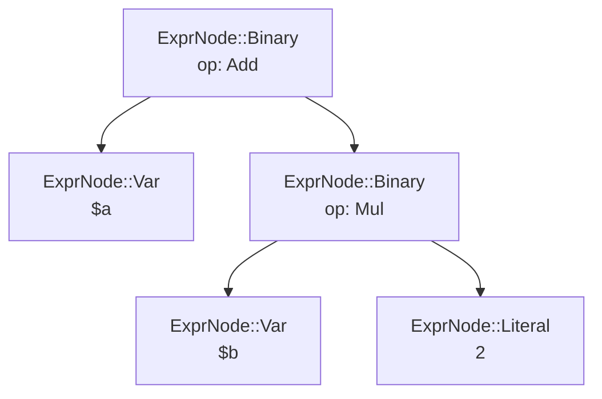

> Example: `expr {$a + $b * 2}` — the AST respects operator precedence
> (`*` binds tighter than `+`).

See also: [Expression parsing](design/compiler/expression-parsing.md).
KCS tag: `lexing`.

### dialect

The Tcl language-variant selector that picks which syntax and command
set apply. The catalog holds nineteen profiles: the core versions
`tcl8.4`, `tcl8.5`, `tcl8.6`, `tcl9.0`, `tcl9.1`; the F5 flavours
`f5-irules`, `f5-iapps`, `f5-tmsh`, `f5-bigip`; `bpf`, `expect`,
`spectcl`, `sslictcl`; and the EDA vendors `cadence-eda-tcl`,
`intel-quartus-eda-tcl`, `mentor-eda-tcl`,
`microchip-libero-eda-tcl`, `synopsys-eda-tcl`, `xilinx-eda-tcl`.
It is threaded from the workspace's
language id all the way through the pipeline. On the lexer side,
`LexerConfig::for_dialect` (`tcl_lexer::lexer`) turns a dialect name
into the right flags — for example `tcl8.4` disables `{*}` word
expansion and `f5-irules` enables the iRules brace separator, while an
unknown name falls back to the Tcl-8.5+ defaults so a typo never
silently changes parsing. On the registry side, each command's
availability is stated as a `&[SpecSurface]` — rows saying which provider
offers it over which release windows (`tcl_dialect::model`) — and answered
against the document's point; `surface: None` on a `CommandSpec` means the
command is available everywhere.

See also: [Command registry](design/compiler/command-registry.md).
KCS tag: `lexing`.

---

## Phase 2 — Segmentation and error recovery

No new terms — this phase produces `SegmentedCommand` objects and *ghost*
byte injections (see [Example 20](design/example-script-walkthroughs.md#example-20-error-recovery--unclosed-bracket)).
There is no distinct token type for an injected delimiter: `segment_with_recovery()`
(`rust/tcl-compiler/src/segmenter.rs`) accumulates a `ghosts: BTreeMap<u32, u8>`
mapping a source offset to the byte inserted there, and re-lexes through
`build_document_with_ghosts`.

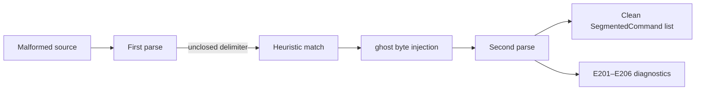

### Command walk

The registry-driven analyser traversal that visits each segmented command
before IR lowering. It combines the lexer's `args` and `arg_tokens` with the
resolved `CommandSpec`, including command forms, options, subcommands,
dialect availability, and argument roles. Command-validity, security,
version, iRules-event, Tk, and scope diagnostics originate here; they do not
require a typed IR statement. Implemented across `tcl_compiler::analyser`.

KCS tag: `command-walk`.

### Concrete syntax tree (CST) / red-green tree

The lossless, position-independent syntax tree the segmenter builds, and the
representation the formatter, minifier, AOT lowering, and per-command tooling
read from. It follows the Roslyn / rust-analyzer **red-green** split: the
*green* tree stores only *widths* and children, with structurally identical
subtrees comparing equal by value. Children are inline, so the current CST
does not pointer-share subtrees or provide cross-edit reuse; a *red* overlay
resolves absolute positions lazily, reproducing the exact `Token` offsets the
lexer emits. **Trivia** (whitespace, end-of-line, comments) is *attached* to the
adjacent token rather than living as sibling tokens, so a command is pure
syntax while every byte still round-trips. `SegmentedCommand`s are derived from
it byte-identically. Implemented in `tcl_compiler::parsing::syntax`.

> Distinct from the [green token tree](design/compiler/green-token-tree.md),
> an **unbuilt proposal** for a context-aware tokenisation memo with
> absolute-position tokens. `TokenRegion` does not exist in the workspace.

See also: [The canonical concrete syntax tree](design/compiler/syntax-tree.md).
KCS tag: `lexing`.

---

## Phase 3 — IR lowering

### Lowering

The pass that turns the tokenised command stream into typed IR
statements. Every command known to the registry maps to one or more
`Statement` nodes via an `arg_roles` table that says which tokens
are expressions, bodies, variable names, or literal arguments. The
lowering dispatch is what lets the analyser treat `if`, `while`,
`proc`, and user-defined commands uniformly downstream. Implemented
in `tcl_compiler::lowering`.

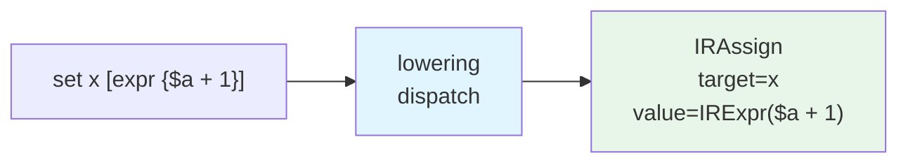

> Lowering is where a token stream stops being a list of words and
> starts being a program the analyser can reason about.

See also: [IR types and lowering](design/compiler/ir-types-lowering.md)
and [Lowering dispatch](design/compiler/lowering-dispatch.md).
KCS tag: `lowering`.

### IR

Intermediate Representation — a structured, typed representation of Tcl
commands between parsing and code generation.  Defined in
`tcl_compiler::ir`; the union type `Statement` covers all statement
kinds.

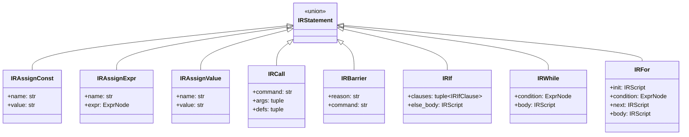

See also: [IR types and lowering](design/compiler/ir-types-lowering.md).
KCS tag: `lowering`.

### Barrier

The IR statement that stands in for a command whose runtime effects
defeat static analysis. `eval`, `uplevel`, and `upvar` can name and
rewrite arbitrary variables, and a control-flow command whose body or
option words are not literal — `if` with a non-literal body, `switch`
with a computed arm list, `catch` with a dynamic body — cannot be
lowered to structured IR at all. Lowering emits a barrier in their
place, carrying the original command name, its argument texts, and a
human-readable reason. SCCP widens the values it is tracking to
`Overdefined` at a barrier, and load forwarding (`O102`) refuses to
carry a literal past one, because the command could have reassigned
the name in between. Defined as `Statement::Barrier` in
`tcl_compiler::ir`.

See also: [IR types and lowering](design/compiler/ir-types-lowering.md).
KCS tag: `lowering`.

### CommandSpec

The central metadata type for a Tcl command — describes its argument
layout, purity, side effects, taint properties, event validity, and
dialect membership.  See `CommandSpec` in `tcl_registry::spec`.

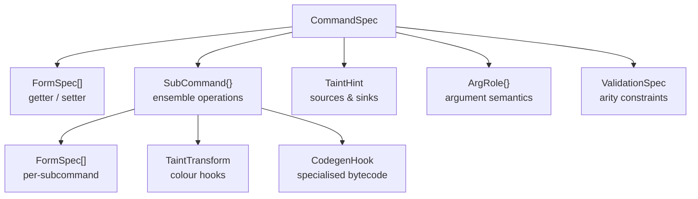

See also: [Command registry](design/compiler/command-registry.md)
and [Command registry event model](design/contracts/command-registry-event-model.md).

### SubCommand

An ensemble operation selected by the first argument (e.g.
`string length`, `HTTP::header value`).  Each has its own arity, purity,
return type, and taint transform hooks.  See `SubCommand` in
`tcl_registry::spec`.

See also: [Command registry](design/compiler/command-registry.md).

### FormSpec

An invocation form of a command — getter (reads state) or setter (writes
state), each with its own arity and side-effect classification.  See
`FormSpec` in `tcl_registry::hover`.

See also: [Command registry](design/compiler/command-registry.md).

### Lifecycle (registry)

The `introduced` / `deprecated` / `retired` triple every gateable registry
entity carries — a command, subcommand, second-level subcommand, option,
option constraint, side effect, form, or literal argument value — on
either its owning package's version axis or the core Tcl axis.
`introduced` is the first release an entity exists in; `retired` is the
first release it no longer exists in, an **exclusive** bound (`retired:
10.0.0` means 10.0.0 is the first release without it, not the last one
with it); `deprecated` marks it on notice while still available. A
retired entity is never also reported deprecated. A child's lifecycle
must stay inside its declaring parent's window — checked by
`Lifecycle::intersect` — which the registry sweep enforces as a hard gate
for every compiled-in spec. See `Lifecycle` in `tcl_registry::lifecycle`.

See also: [SpecTcl pack design](design/spec-packs.md#version-ranges-introduced-deprecated-retired),
[W135](kcs/codes/kcs-diagnostic-w135-command-needs-newer-package.md),
[W139](kcs/codes/kcs-diagnostic-w139-retired-at-resolved-version.md),
[W144](kcs/codes/kcs-diagnostic-w144-deprecated-at-resolved-version.md).

### Version floor

The resolved minimum version of a package (or, on the Tcl-core axis, of
Tcl itself) a source file is checked against when deciding whether a
[lifecycle](#lifecycle-registry)-gated entity is available. The floor
comes from the active dialect profile's library pin, raised by the
highest guaranteed lower bound among the file's unconditional, unguarded
`package require <pkg> <req>` lines — a require inside a branch that may
not run (an `if` body, a `catch`, a `try` body or handler) does not count,
because it does not guarantee the version on every path; a `try`
`finally` script does, because it always runs. An explicit require can
only *raise* the floor, never lower what the profile already ships. See
`Analyser::package_version_floor` in
`tcl_compiler::analyser::diagnostics::version_gate`.

See also: [W135](kcs/codes/kcs-diagnostic-w135-command-needs-newer-package.md).

### Requirement straddle

The case where a `package require Foo A-B` version **range** admits more
than the [version floor](#version-floor) alone guarantees: the floor
check asks only about `A`, but the loaded package could really be
anywhere in `[A, B)`, so a range whose stated upper bound `B` reaches past
an entity's retiring release leaves that entity missing from part of the
accepted window even though the floor is satisfied. Only a **stated**
upper bound participates — a bare `A` or an open `A-` states no ceiling
and cannot straddle anything. The straddling case reports the ordinary
`W139` with a hedged message ("not available in every version satisfying
requirement …") rather than the plain retirement wording, because the
entity genuinely is available at the low end of the range. See
`Analyser::requirement_straddle_diagnostic` in
`tcl_compiler::analyser::diagnostics::version_gate`, and
`tcl_registry::version::requirement_upper_bound`.

See also: [W139](kcs/codes/kcs-diagnostic-w139-retired-at-resolved-version.md).

### ObjectClassSpec

Registry metadata for a `TclOO` / megawidget class whose instances are
dispatched as `$obj <method> …`.  Attached to the class factory command and
carrying the class's instance methods (each a `SubCommand`), so an object
handle's method options resolve through the registry.  See `ObjectClassSpec`
in `tcl_registry::spec`.

See also: [Command registry](design/compiler/command-registry.md).

### Symbol-definer command

A command whose registry `CommandSpec` carries a `defines_symbol` (`SymbolDef`)
descriptor, declaring that one of its arguments binds a navigable definition
*name* the editor outline should list — the tcltest definers `test NAME …`
(test case), `testConstraint NAME value` (constraint), and `customMatch MODE
command` (match mode).  The descriptor gives the name argument index, an
optional description argument, an optional `requires_arg` (record only when that
argument is present, so a setter defines but a same-named getter does not), and
the outline category (`DefinedSymbolKind` — `Test` / `Constraint` / `Matcher`).
Every symbol consumer (document + workspace symbols) discovers the definition
generically from the registry, so the name is resolved through the analyser's
constant-propagation lattice and recorded without any command-name check.  See
`SymbolDef` in `tcl_registry::symbol_def`.

See also: [Command registry](design/compiler/command-registry.md).

### Object handle

A command name that names a `TclOO` object instance (returned by
`Class new` / bound by `Class create name`), invoked as `$handle method …`.
The [object-handle tracking](design/compiler/command-registry.md) harvests
`set var [Class new]` provenance so `$var` is known to hold an instance of a
registry-modelled class.

---

## Phase 4 — CFG construction

### Basic block

A straight-line sequence of IR statements with no branches except at the
end.  Represented by `Block` in `tcl_compiler::cfg`.

See also: [CFG construction](design/compiler/cfg-construction.md).
KCS tag: `cfg`.

### CFG

Control Flow Graph — a directed graph of basic blocks connected by jumps
and branches.  Built by `build_cfg()` in `tcl_compiler::cfg_builder`
(producing a `CfgModule`).

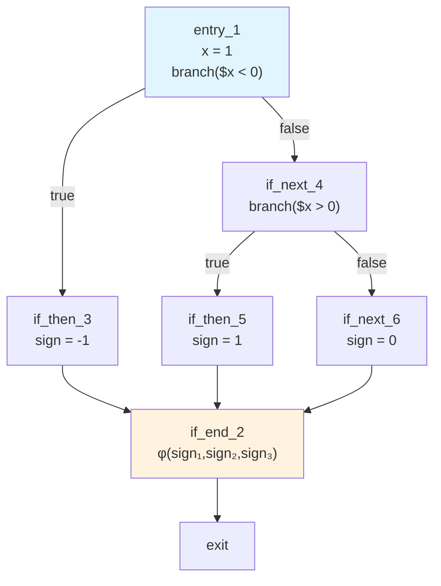

> Example: `if/elseif/else` chain from Example 7.

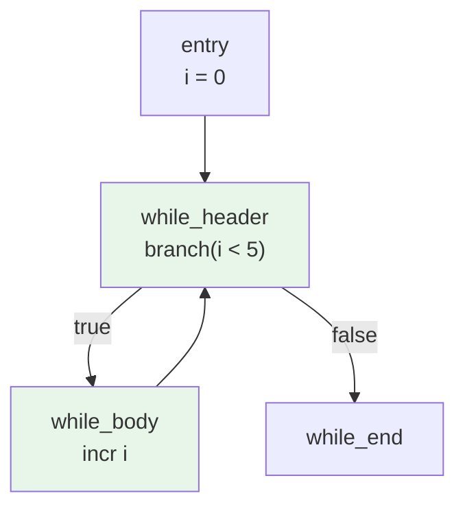

> Example: `while` loop with back-edge from body to header.

See also: [CFG construction](design/compiler/cfg-construction.md)
and [Control flow patterns](design/compiler/control-flow-patterns.md).
KCS tag: `cfg`.

---

## Phase 5 — SSA construction

### SSA

Static Single Assignment — a form where every variable is defined exactly
once.  Multiple definitions of the same source variable get unique
*version numbers* (e.g. `x₁`, `x₂`).  Built by `build_ssa()` in
`tcl_compiler::ssa` (producing a `SsaFunction`).

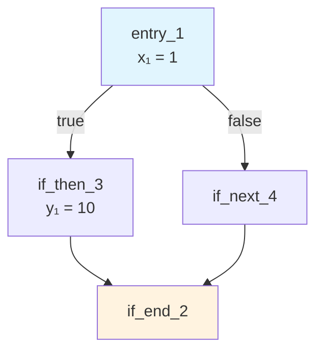

> Unique version per definition: `x₁` in entry, `y₁` in then-branch.

See also: [SSA construction](design/compiler/ssa-construction.md)
and [CFG/SSA fact model](design/compiler/cfg-ssa-fact-model.md).
KCS tag: `ssa`.

### SSA value key

A `(variable_name, version)` tuple that uniquely identifies one
definition of a variable.  Type alias `SsaValueKey` in
`tcl_compiler::def_use`.

See also: [SSA construction](design/compiler/ssa-construction.md).
KCS tag: `ssa`.

### Phi node (φ)

An SSA construct placed at control flow merge points.  `φ(x₁, x₃)` means
"use `x₁` if control arrived from predecessor 1, or `x₃` if from
predecessor 2."  Represented by `Phi` in `tcl_compiler::ssa`.

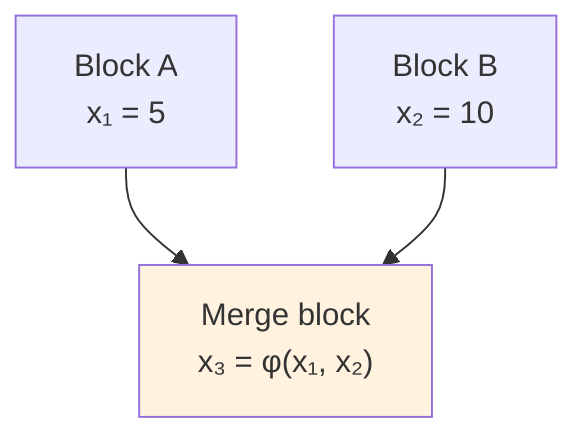

> The phi node selects `x₁` or `x₂` based on which predecessor executed.

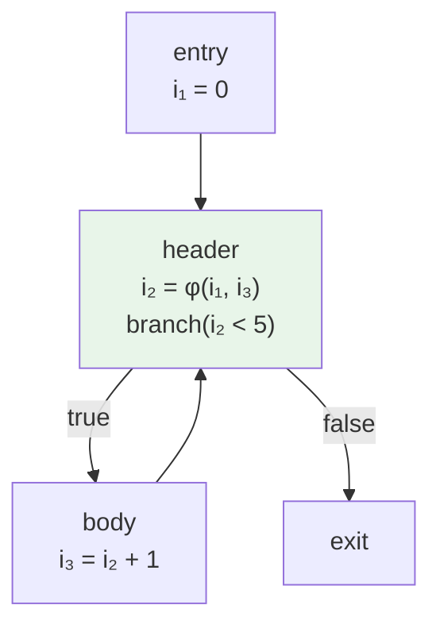

> Loop phi: merges the initial value (`i₁ = 0`) with the loop-carried
> update (`i₃`).

See also: [SSA construction](design/compiler/ssa-construction.md).
KCS tag: `ssa`.

### Dominator / idom

Block A *dominates* block B if every path from the entry to B passes
through A.  The *immediate dominator* (`idom`) is the closest dominator.
Stored in `SsaFunction.idom` (`tcl_compiler::ssa`).

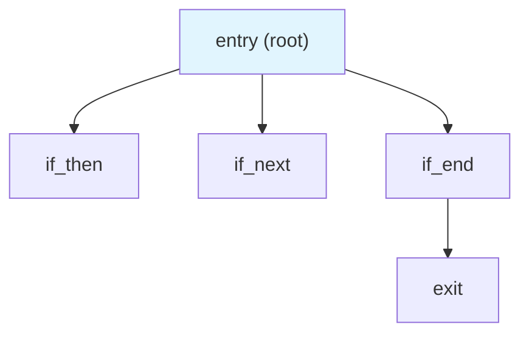

> Dominator tree for an `if/else`: entry dominates all blocks.
> `if_end` dominates `exit`.

See also: [SSA construction](design/compiler/ssa-construction.md).
KCS tag: `ssa`.

### Dominance frontier

The set of blocks where a variable's dominance "ends" — these are where
phi nodes must be inserted.  Stored in
`SsaFunction.dominance_frontier` (`tcl_compiler::ssa`).

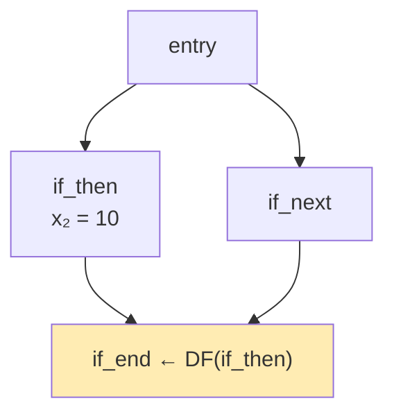

> `if_end` is in the dominance frontier of `if_then` for variable `x` —
> a phi node is placed here.

See also: [SSA construction](design/compiler/ssa-construction.md).
KCS tag: `ssa`.

---

## Phase 6 — Core analyses

### SCCP

Sparse Conditional Constant Propagation — a combined constant propagation
and unreachable-code analysis that runs over the SSA graph.  Implemented
by `sccp()` in `tcl_compiler::sccp`.

See also: [SCCP and core analyses](design/compiler/sccp-core-analyses.md).
KCS tag: `sccp`.

### Lattice

A mathematical structure used in dataflow analysis where values flow from
*bottom* (unknown) toward *top* (overdefined).  The SCCP value lattice is
`LatticeValue` (`tcl_compiler::analyses`); the type lattice is
`TypeLattice` (`tcl_compiler::types`).

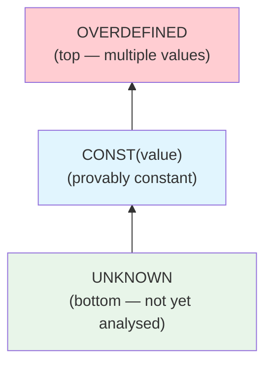

> SCCP value lattice.  Values flow upward — once a value reaches
> OVERDEFINED it never goes back.

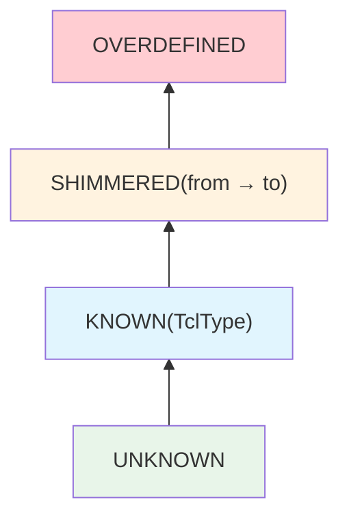

> Type lattice.  SHIMMERED records forced type coercion.

See also: [SCCP and core analyses](design/compiler/sccp-core-analyses.md)
and [Constant folding and type inference](design/compiler/constant-folding-type-inference.md).
KCS tag: `sccp`.

### Liveness

A dataflow analysis that determines which SSA values are "live" (may
still be read) at each program point.  Liveness is computed where a
consumer needs it rather than stashed on a per-function aggregate:
`live_out_by_name()` (`rust/tcl-compiler/src/slot_allocation.rs`) for slot
interference, and `liveness_dead_stores()`
(`rust/tcl-compiler/src/dead_stores.rs`) for the `DeadStore` list, both
reading the `FunctionUnit` that `CompilationUnit::build_for()` builds.

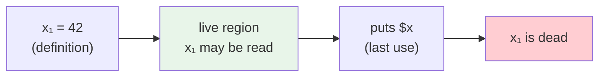

> A value is live from its definition until its last use.  After that,
> it is dead and can be eliminated.

See also: [SCCP and core analyses](design/compiler/sccp-core-analyses.md).
KCS tag: `liveness`.

### Shimmer

Tcl's internal type coercion: when a value's string representation is
reinterpreted as a different type (e.g. `"42"` read as an integer).
Recorded by the `Shimmered` kind of `TypeLattice` (`tcl_compiler::types`).

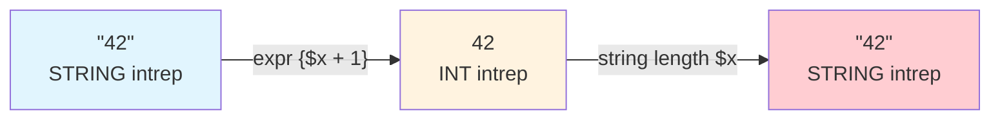

> Each arrow is a shimmer — Tcl silently converts the internal
> representation.  Excessive shimmering degrades performance.

Most shimmers are a performance concern (`S100`/`S101`/`S102`, plus the
shared-value copy-on-write cost `S103` — mutating a value another live
variable still holds makes Tcl duplicate it first).  One shimmer is
a **correctness** concern: a byte array (binary data) forced through
character-string semantics and written back as bytes re-encodes every byte
`≥ 0x80` (latin-1 decode → UTF-8 encode), corrupting the data.  This is
reported as `S110` — the iRules `*::payload` rewrite bug and the plain-Tcl
`binary format` → `string …` → `binary scan` round-trip.  See
[`kcs-feature-byte-array-corruption.md`](kcs/features/kcs-feature-byte-array-corruption.md).

See also: [Shimmer reference behaviour](design/contracts/shimmer-reference-behaviour.md).
KCS tag: `shimmer`.

### Type inference

Flow-sensitive inference of a Tcl value's type over the SSA graph.
The type lattice has `UNKNOWN`, `KNOWN(TclType)`, `SHIMMERED(from → to)`,
and `OVERDEFINED` states; join points use lattice meet and record a
shimmer when two different known types meet.  Implemented in
`tcl_compiler::types` and driven from `tcl_compiler::analyses`.

See also: [SCCP and core analyses](design/compiler/sccp-core-analyses.md)
and [Constant folding and type inference](design/compiler/constant-folding-type-inference.md).
KCS tag: `type-infer`.

### Value transfer

The proposed registry-owned description of how one command invocation
transforms the [SCCP](#sccp) lattice: the value each written variable
holds afterwards and the value the command returns. A *pure* transfer is
a `const_fold` (`[string range foobarbaz 3 6]` → `barb`); a *cell*
transfer reads a variable and writes it back (`incr`, `append`,
`lappend`, `dict incr`); a *destructure* transfer writes several
variables (`lassign`, `scan`, `regexp` with match variables); *destroy*
and *iterate* cover `unset` and `foreach`. Declared as
`CommandSpec::value_transfer` or derived from existing facts, resolved by
one query, applied by SCCP under the trust, escape, trace, and dialect
gates every fold already obeys, and authorable by a `.tclspec` pack as a
`cell_fold` / `destructure_fold` body. Not yet implemented.

See also: [Value transfers](design/compiler/value-transfers.md) and
[Constant folding](#constant-folding).

### Def-use chains

Per-SSA-value map of where each value is defined and where it is read.
The compiler builds one entry per SSA version and uses it to drive
liveness, dead-store elimination, inlining, and the data-flow graph.
Implemented in `tcl_compiler::def_use`.

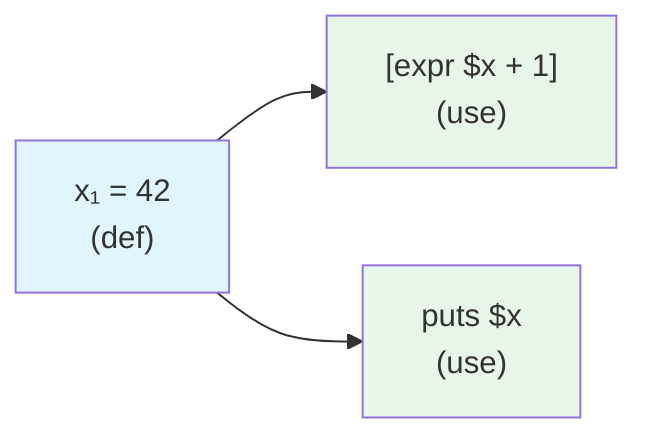

> Each SSA definition has exactly one def site and a list of use sites.

See also: [Def-use chains](design/compiler/def-use-chains.md).
KCS tag: `dataflow`.

### Data-flow graph

A directed graph of SSA values and the commands that produce and
consume them, derived from def-use chains. Downstream consumers query
it to answer "where does this value come from?" and "what depends on
this value?" without re-walking the IR.  Implemented in
`tcl_compiler::dataflow_graph`.

See also: [Data-flow graph](design/compiler/dataflow-graph.md).
KCS tag: `dataflow`.

### Memory-SSA

An extension of SSA that versions memory operations (array writes,
upvar aliases, namespace globals) the same way scalar SSA versions
values. Each memory write creates a new memory version; each memory
read points at the version it sees. Alias sets record which writes may
affect which reads. Implemented in `tcl_compiler::memory_ssa`.

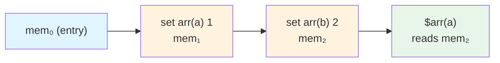

> Each write produces a new memory version; reads point at the most
> recent version that could have written the cell they read.

See also: [Memory-SSA](design/compiler/memory-ssa.md).
KCS tag: `memssa`.

### Side-effects

Structured classification of what a command does beyond returning a
value: reads variables, writes variables, mutates memory, performs
I/O, raises exceptions, or has unknown effects. Used to decide whether
a call is a barrier for constant propagation, code sinking, and dead-
store elimination. Implemented in `tcl_compiler::side_effects`.

See also: [Side-effects system](design/compiler/side-effects-system.md).
KCS tag: `side-effects`.

### Trace

A Tcl callback attached to a variable (`trace add variable NAME ops
HANDLER`, or the deprecated `trace variable` / `vdelete` spellings)
that runs arbitrary script on every read, write, or unset of that
name. A read handler can run any command and a write handler can
rewrite the value being stored, so a use of a traced name is never
equivalent to its last literal assignment. Lowering records two
whole-module facts — `Module::traced_variables`, the literal names a
trace targets anywhere in the module, and
`Module::has_dynamic_variable_trace`, set when the target name is
itself computed, which forces every variable to be treated as traced.
SCCP, the propagation optimiser, and taint all consult them before
forwarding a value or dropping a store. Membership is registry-driven
(`Traits::ESTABLISHES_VARIABLE_TRACE`), never a hardcoded command
list. The flow-sensitive counterpart, which marks only the accesses
that follow the installing call, is the alias / observability lattice
in `tcl_compiler::var_observability`.

See also: [Constant folding and type inference](design/compiler/constant-folding-type-inference.md)
and [variable-trace dispatch](design/contracts/variable-trace-dispatch-and-introspection.md).

### Special variable

An interpreter-, `init.tcl`-, or platform-provided global that behaves
unlike a user variable: its write is observed by the runtime even when
the script never reads it back (`auto_path`), its read is always defined
(never read-before-set), and it may carry a write side-effect
(`tcl_precision`) or be a taint source (`env`, `argv`). Modelled in the
dialect-versioned `tcl_registry::special_vars` registry, which the
analyser, taint / side-effect passes, and hover provider consult instead
of hardcoding name lists. Dialect-aware — iRules provides the `static::`
namespace and BIG-IP `tcl_platform` keys but not `env` / `argv`.

See also: [Special-variable registry](design/special-variable-registry.md).

### Rendered-value properties

A may/must lattice over the possible string contents of an SSA value
at each program point. It answers questions like "does this string
always start with `/`?", "can this ever contain a newline?", and "is
this provably one of a small finite set of values?". Implemented in
`tcl_compiler::rendered_properties`.

See also: [Rendered value properties](design/compiler/rendered-value-properties.md).
KCS tag: `rendered-props`.

---

### Value provenance

The finite set of *written constants* that can reach a variable use at a
program point, each carrying the source span of its defining literal
when that literal is written verbatim (the **writable provenance
span**). Computed by walking the SSA use-version's reaching definitions
through phi joins and pure copy chains
(`tcl_compiler::value_provenance`); any non-literal reaching definition
makes the site unprovable, the sound abstention. Drives the
constant-`$cmd` dispatch settlement: navigation anchors at the dispatch
head, while rename rewrites the defining literals.

See also: [Name resolution](design/name-resolution.md).

---

### Interpreter domain

The analyser's identity for one child interpreter: its literal `interp`
path (qualified against enclosing `interp eval` bodies), its safe state
and hide/expose deltas, and its deletion epoch (a deleted-and-recreated
path is a fresh domain). Evaluation bodies home under the synthetic
`@interp@<path>` namespace, unrepresentable in real Tcl, so a parent
namespace of the same name can never collide.

See also: [Name resolution](design/name-resolution.md).

---

### Source edge

The record that one document loads another via `source` — the workspace
index uses these edges to re-home a sourced file's definitions under
each source site's namespace and to rewrite `source` literals when a
file is renamed. A `source` call that can never execute (hidden in a
safe interpreter) contributes no edge.

---

## Phase 7 — Interprocedural analysis and specialised passes

### Compilation unit

Every compiled artefact for one source document, held in a single
value. The unit carries the source text, the lowered [IR](#ir) module,
the module [CFG](#cfg), and one **function unit** per top-level body,
procedure, `TclOO` method, and `apply` / `namespace eval` body. Each
function unit in turn carries that function's CFG, [SSA](#ssa) form,
[def-use chains](#def-use-chains), and the core-analysis lattices
([SCCP](#sccp), [types](#type-inference), [taints](#taint-analysis),
and [rendered-value properties](#rendered-value-properties)). The
[interprocedural summary](#ipa) and the caller-scope facts hang off the
unit as a whole. A pass reads what it needs from the unit rather than
re-lexing or re-lowering, and the unit is also the scope the
interprocedural passes reason about — "every call site" means every
call site in this unit, which is why [unit linkage](#unit-linkage)
exists to say when that is not the whole story. Defined as
`CompilationUnit` (and `FunctionUnit`) in
`tcl_compiler::compilation_unit`, built by
`CompilationUnit::build_with_options`; the language server takes one
per document from the [salsa](#salsa) `compilation_unit` query in
`tcl-lsp-db`.

See also: [Compilation unit contracts](design/compiler/compilation-unit-contracts.md)
and [Compilation unit scope](design/compiler/compilation-unit-scope.md).

### Unit linkage

The registry-declared fact that a file is part of a **bigger program**, and
so has callers its own compilation unit cannot enumerate. Carried as `Traits`
bits on the command specs — `PROVIDES_PACKAGE` (`package provide`),
`EXPORTS_COMMAND` (`namespace export`), `LOADS_EXTERNAL_UNIT` (`source`,
`load`, `package require`) — and read generically via
`CommandRegistry::unit_linkage`, so no command name appears in the compiler.
The interprocedural constant seed refuses to treat a file's visible call
sites as the complete caller set once a linkage trait is present, unless the
host supplied cross-file call-site evidence. See
[compilation-unit-scope.md](design/compiler/compilation-unit-scope.md).

### Call-site evidence

The per-callee, per-argument-position record of what every resolvable call
passes — `CallSiteEvidence` in `tcl_compiler::unit_scope`. Merging evidence
from another file is *monotone*: it adds values, unknowns, and observed
argument counts, so a second file can retract a constant fold but never
manufacture one. An **opaque caller** (a deferred `-command` prefix, a
`rename`, an import binding a new name) is recorded as "a call site exists
whose arguments are unknown" rather than being left out.

### IPA

Interprocedural Analysis — walks every proc in the compilation unit
and records a `ProcSummary` for each one. The summary captures the
proc's pure/impure classification, its side-effect set, the taint
colours it propagates, and any constant return value it can prove.
Downstream passes (ICIP, taint, optimiser) query summaries to decide
whether a call site can be folded, inlined, or sunk without re-
walking the callee's body. Implemented in
`tcl_compiler::interprocedural`.

```mermaid
flowchart LR
    P1["proc double x"] -->|"summarise"| S1["ProcSummary<br/>pure=true<br/>returns 2*x"]
    P2["proc append_log msg"] -->|"summarise"| S2["ProcSummary<br/>pure=false<br/>writes log"]
    S1 --> ICIP["ICIP: fold [double 21] → 42"]
    S2 --> BARRIER["taint: treat call as barrier"]

    style S1 fill:#e8f5e9
    style S2 fill:#ffcdd2
```

> Each proc becomes a `ProcSummary`; call sites query the summary
> instead of re-analysing the callee.

See also: [Interprocedural analysis](design/compiler/interprocedural-analysis.md).
KCS tag: `ipa`.

### ICIP

Interprocedural Constant/Inline Propagation — evaluates procedure calls
with known constant arguments at compile time and replaces the call with
the result.  Reported as `O103`.  The foldability facts come from the
callee's [`ProcSummary`](#ipa) — `can_fold_static_calls` and
`constant_return` in `tcl_compiler::interprocedural`.  Two sites in
`tcl_compiler::optimiser::propagation` consume them:
`try_o103_proc_fold()` rewrites a `[proc …]` command substitution
inside another call's arguments, and `try_fold_static_proc_call()`
handles the bare statement form, which stays hint-only because folding
`::answer` to `42` there would leave an invalid command name.

```mermaid
flowchart LR
    CALL["[double 21]"] -->|"evaluate body<br/>with n=21"| BODY["expr {21 * 2}"]
    BODY -->|"fold"| RESULT["42"]

    style CALL fill:#e1f5fe
    style RESULT fill:#e8f5e9
```

See also: [Optimisation passes](design/compiler/optimisation-passes.md)
and [IPA](#ipa). KCS tag: `ipa`.

### LICM

Loop-Invariant Code Motion — hoists computations that produce the
same value on every iteration out of the loop body. Reported as
`O106`. The safety check uses GVN numbers and memory-SSA to confirm
that the hoisted expression's inputs do not change inside the loop.
See `tcl_compiler::gvn`.

```mermaid
flowchart LR
    subgraph before
        B1["set n [llength $xs]"] --> B2["for {} {$i < [llength $xs]}"]
    end
    subgraph after
        A1["set n [llength $xs]"] --> A2["for {} {$i < $n}"]
    end
    before -->|"O106: hoist [llength $xs]"| after

    style B2 fill:#ffcdd2
    style A2 fill:#e8f5e9
```

See also: [Optimisation passes](design/compiler/optimisation-passes.md).
KCS tag: `licm`.

### Tail-call optimisation

A family of transformations that turn a proc's recursive tail call into a
`tailcall` command (`O121`), or fully iterative code when every call
is a tail call (`O122`). The pass walks the IR structurally and visits
only the [tail positions](#tail-position) of a proc body, so a call
with any work left to do after it is never a candidate. `O121` is
suppressed on dialects whose base Tcl version predates `tailcall`
(Tcl 8.6, TIP 327) — `f5-irules` and `tcl8.4` / `tcl8.5` profiles
among them. `O123` is an accumulator-introduction hint for procs that are
almost but not quite tail-recursive. Implemented in
`tcl_compiler::optimiser::tail_call`.

```mermaid
flowchart TD
    REC["proc fact {n acc}<br/>  if {$n == 0} {return $acc}<br/>  return [fact [expr {$n-1}] [expr {$n*$acc}]]"]
    REC -->|"O121: tailcall"| TC["replace return-call<br/>with tailcall"]
    REC -->|"O122: while loop"| WL["recast as iterative while"]

    style REC fill:#e1f5fe
    style TC fill:#e8f5e9
    style WL fill:#e8f5e9
```

See also: [Tail-call recursion optimisation](design/compiler/tail-call-recursion-optimisation.md).
KCS tag: `tail-call`.

### Tail position

The place in a proc body where a call is the last thing the body runs:
the final statement of the body, or the final statement of every branch
of an `if` / `elseif` / `else` or `switch` that ends it. A `return`
whose value is a single command substitution counts as well, so
`return [f $n]` is a tail call but `return [a][b]` is not. A call
anywhere else — inside `expr`, `catch`, `try`, a loop body, or a nested
command substitution — is not in tail position, and `O121` / `O122`
leave it alone. The walk that collects them is `collect_tail_sites` in
`tcl_compiler::optimiser::tail_call`.

See also: [Tail-call recursion optimisation](design/compiler/tail-call-recursion-optimisation.md).
KCS tag: `tail-call`.

### Constant folding

Compile-time evaluation of expressions whose inputs are all known
constants, so the runtime sees the result directly instead of the
computation. Covers constant propagation (`O100`), integer expression
folding (`O101`), a variable's single reaching literal load forwarded
to its use sites (`O102`), redundant-nested-`[expr]` removal (`O115`),
list folding (`O116`, `O118`), and string-compare simplification
(`O117`). Implemented in `tcl_compiler::optimiser::propagation`.

`O102` forwards a variable's literal value into its use sites — a
pure-literal `[expr {...}]}` substitution with no propagated variable
is `O101`'s own fold instead. The two commonly co-fire: propagating a
literal into an `[expr {...}]}` operand (`O102`) frequently exposes an
`O101` fold of the resulting expression, as below.

```mermaid
flowchart LR
    IN["set a 5\nset x [expr {$a + 3}]"] -->|"O102: forward, then O101: fold"| OUT["set x 8"]

    style IN fill:#e1f5fe
    style OUT fill:#e8f5e9
```

See also: [Optimisation passes](design/compiler/optimisation-passes.md)
and [Constant folding and type inference](design/compiler/constant-folding-type-inference.md).
KCS tag: `const-fold`.

### Strength reduction

A family of peephole transformations that replace an expensive operation
with a cheaper one that computes the same value: `$x ** 2` becomes
`$x * $x`, `$x % 8` becomes `$x & 7`, and so on. The pass fires as
part of expression simplification and is reported under `O113`.
Implemented in `tcl_compiler::optimiser::propagation`.

See also: [Optimisation passes](design/compiler/optimisation-passes.md).
KCS tag: `strength-reduce`.

### Pattern recognition

The optimiser pass that matches a whole source idiom rather than a
single expression, and rewrites it to the shorter form Tcl already
provides: `set x [expr {$x + 1}]` becomes `incr x` (`O114`), length
arithmetic in an index argument becomes `end` / `end-N` (`O128`), a
write-only `set` plus `append` / `lappend` build chain collapses into
one literal `set` (`O104`, `O130`), and three or more contiguous
constant `set`s suggest a single `lassign` (`O119`, hint-only). Each
rewrite is gated on the variable being provably safe to fold — an
`O114` rewrite needs every SSA version of the name to be an integer,
because `expr` promotes a float operand where `incr` raises an error.
Implemented in `tcl_compiler::optimiser::pattern_recognition`.

See also: [Optimisation passes](design/compiler/optimisation-passes.md).
KCS tag: `pattern`.

### GVN

Global Value Numbering — an optimisation that detects redundant
computations by assigning a canonical identity to each expression.  See
`tcl_compiler::gvn`.

See also: [Optimisation passes](design/compiler/optimisation-passes.md).
KCS tag: `gvn`.

### CSE

Common Subexpression Elimination — detects when the same pure computation
is evaluated more than once and suggests extracting it to a variable.
Part of the GVN pass, reported as `O105`.  See `tcl_compiler::gvn`.
Reusing a *command* result additionally requires a
[dispatch-stability proof](#dispatch-stability-proof).

```mermaid
flowchart TD
    A["set a [HTTP::uri]"] --> B["set b [HTTP::uri]"]
    B -.->|"O105: redundant"| FIX["set _uri [HTTP::uri]<br/>set a $_uri<br/>set b $_uri"]

    style B fill:#ffcdd2
    style FIX fill:#e8f5e9
```

See also: [Optimisation passes](design/compiler/optimisation-passes.md).
KCS tag: `cse`.

### Dispatch-stability proof

The typed, per-call-site evidence that Tcl's mutable dispatch machinery cannot
change *which* command an invocation runs, and cannot observe it running.
Produced by `tcl_compiler::dispatch_proof` as a `SiteDispatchProof`, which
records the registry dispatch-dependency domains proven stable at that site,
the [world-state contents lattice](#world-state-contents-lattice) versions the
value key must pin, and whether every operand word is admissible.  Without a
complete proof [GVN](#gvn) declines to report a repeated command as
[CSE](#cse), because a referentially transparent result is not the same thing
as an observationally removable call — an execution trace, `rename`, alias,
ensemble, `unknown` handler, or interpreter-policy change makes the second call
visible.

See also: [Dispatch-stability proofs](design/compiler/dispatch-stability-proof.md).
KCS tag: `gvn`.

### World-state contents lattice

The bounded abstract state that a dispatch-stability proof is read from: a
forward dataflow [lattice](#lattice) over the executable semantic graph that
tracks, per dispatch domain, whether the domain provably still holds its
declared entry contents and has no live observer.  Command bindings and
`TclOO` dispatch use changed-subject ledgers, traces use saturating
registration-count intervals per target, namespace lookup, namespace
`unknown`, and interpreter policy use stability flags, and variable aliases use
a link ledger.  Every ledger is bounded and widens to top on overflow; unknown
and dynamic transitions widen conservatively.  Entry contents come from an
explicit `DispatchEntryAssumption` contract, never from a "nothing was seen in
this file" heuristic.  Implemented in `tcl_compiler::dispatch_proof`, alongside
the world-state SSA versioning in `tcl_compiler::world_state_ssa`.

```mermaid
flowchart BT
    ENTRY["entry contract<br/>(contents asserted)"]
    PART["partly changed<br/>(named subjects, counted traces)"]
    TOP["widened<br/>(top — nothing proven)"]
    ENTRY --> PART --> TOP

    style ENTRY fill:#e8f5e9
    style PART fill:#e1f5fe
    style TOP fill:#ffcdd2
```

> Contents flow upward.  A join keeps the weaker side, so a trace live on
> either predecessor blocks reuse after the merge.

See also: [Dispatch-stability proofs](design/compiler/dispatch-stability-proof.md).
KCS tag: `dataflow`.

### DCE

Dead Code Elimination — removes code whose result is never used.  `O107`
(basic DCE), `O108` (aggressive DCE following statement liveness), `O109`
(dead store elimination).  See `tcl_compiler::optimiser::elimination`.

```mermaid
flowchart TD
    S1["set x 42"] --> S2["set y 99"]
    S2 --> S3["return $x"]
    S2 -.->|"O109: y never read"| DEAD["dead store"]

    style S2 fill:#ffcdd2
```

See also: [Optimisation passes](design/compiler/optimisation-passes.md).
KCS tag: `dce`.

### InstCombine

Instruction Combine — canonicalises and simplifies expressions by
applying algebraic identities (e.g. `$x * 1` → `$x`, DeMorgan's law).
Reported as `O110`.  See
`tcl_compiler::optimiser::helpers::expr_simplify`.

See also: [Optimisation passes](design/compiler/optimisation-passes.md).
KCS tag: `instcombine`.

### LCP

Loop Constant Propagation / Code Sinking — moves invariant assignments
out of the hot path into the specific branch that uses them.  Reported
as `O125`.  See `tcl_compiler::optimiser::code_sinking`.

```mermaid
flowchart TD
    BEFORE["set msg &quot;error&quot;<br/>if {cond} { ... } else { log $msg }"]
    BEFORE -.->|"O125: sink into<br/>branch that uses it"| AFTER["if {cond} { ... } else {<br/>  set msg &quot;error&quot;<br/>  log $msg<br/>}"]

    style BEFORE fill:#ffcdd2
    style AFTER fill:#e8f5e9
```

See also: [O125 code sinking](design/compiler/o125-code-sinking.md).
KCS tag: `code-sinking`.

### Unused procs elimination

Comments out procs that are defined but never called from any iRule
event or from another reachable proc. The pass walks the call graph
from every event entry point, marks every reachable proc as live,
and turns anything unreached into a `# ` commented-out block so the
reader can see what the pass did. Reported as `O124`. Implemented in
`tcl_compiler::optimiser::unused_procs`.

```mermaid
flowchart LR
    EV1["when HTTP_REQUEST"] --> P1["proc handle_req"]
    P1 --> P2["proc parse_uri"]
    P3["proc legacy_helper<br/>(never called)"] -.->|"O124: comment out"| DEAD["# proc legacy_helper ..."]

    style P1 fill:#e8f5e9
    style P2 fill:#e8f5e9
    style P3 fill:#ffcdd2
    style DEAD fill:#ffcdd2
```

See also: [O124 unused iRule procs](design/compiler/optimiser-o124-unused-irule-procs.md).
KCS tag: `unused-procs`.

### Escape tag

One of two values — `LOCAL` or `FRAME` — attached to each Tcl variable
in a procedure by the var-escape analysis. A `LOCAL` variable is kept in
a WASM local slot (fast); a `FRAME` variable is spilled to the runtime
frame so the interpreter, an `upvar` alias, or a dynamic `set $name`
can observe it by name. The top of the lattice is `FRAME`; joins use
the "any FRAME wins" rule. Defined by `EscapeTag` in
`tcl_compiler::var_escape::types`.

See also: [Var-escape analysis](design/compiler/var-escape-analysis.md).
KCS tag: `var-escape`.

### Frame-only var

Short-hand for a Tcl variable whose escape tag is `FRAME`. The WASM
codegen bypasses the WASM local slot for frame-only vars: reads,
writes, and existence checks go through the runtime frame by name
rather than through a fast local slot. The escape decision comes from
`tcl_compiler::var_escape`; the emitter is `tcl_compiler::codegen::wasm`.

### Var-escape analysis

Per-proc + interprocedural static analysis that decides which Tcl
variables must live in the runtime frame. Handles `upvar`, `global`,
`variable`, dynamic `set $name` / `incr $name`, literal and dynamic
`eval`, `uplevel`, and the frame-inspecting `info` subcommands. Runs a
worklist fixpoint over `direct_callees` to fold callee `upvar` source
sets back into callers. Implemented in `tcl_compiler::var_escape`.

### Taint analysis

Determines whether values originate from untrusted sources (user input).
Uses `TaintLattice` in `tcl_compiler::taint`.

```mermaid
flowchart LR
    SRC["HTTP::header value Host<br/>(taint source)"]
    SRC -->|"TAINTED"| TOL["string tolower<br/>(passes taint through)"]
    TOL -->|"TAINTED"| SINK["HTTP::respond body<br/>(taint sink)"]
    SINK -->|"IRULE3001"| WARN["⚠ XSS warning"]

    style SRC fill:#ffcdd2
    style SINK fill:#ffcdd2
    style WARN fill:#fff3e0
```

See also: [Taint analysis](design/compiler/taint-analysis.md).
KCS tag: `taint`.

### Taint colour

A `Flag` enum describing safety properties of tainted data (e.g.
`CRLF_FREE`, `URL_ENCODED`, `HTML_ESCAPED`).  Colours compose with `|`
and join by intersection (`&`) — only properties shared by all incoming
paths survive.  Defined by `TaintColour` in `tcl_registry::taint`.

```mermaid
flowchart TD
    T1["Path A:<br/>TAINTED | HTML_ESCAPED"]
    T2["Path B:<br/>TAINTED"]
    T1 --> JOIN["φ join: intersection"]
    T2 --> JOIN
    JOIN --> RESULT["TAINTED<br/>(HTML_ESCAPED lost —<br/>not on all paths)"]

    style T1 fill:#e8f5e9
    style T2 fill:#ffcdd2
    style RESULT fill:#ffcdd2
```

> Colours join by intersection: only properties present on **all** incoming
> paths survive the merge.

See also: [Taint analysis](design/compiler/taint-analysis.md).
KCS tag: `taint`.

### Taint source

A command whose return value introduces tainted data (e.g. `HTTP::host`,
`HTTP::uri`).  Declared via the `taint_source` colour on the command's
`CommandSpec` (`tcl_registry::spec`).

See also: [Taint analysis](design/compiler/taint-analysis.md).
KCS tag: `taint`.

### Taint sink

A dangerous argument position where tainted data can cause harm (XSS,
header injection, SSRF).  Classified by `classify_sink()` in
`tcl_compiler::taint`.

See also: [Taint analysis](design/compiler/taint-analysis.md).
KCS tag: `taint`.

---

## Phase 8 — Bytecode codegen

### Compiled artefact

Executable bytecode together with the target facts that authorised it. In
TclVM, `CompiledUnit` owns a `FunctionAsm` plus the dialect-profile, command,
and compile-service provenance under which it was validated. The compiler
provenance records either the service generation that produced the assembly or
an explicit foreign-artifact admission. Consumers carry that unit intact into
an activation, so old assembly cannot be labelled with new provenance after a
runtime mutation.

See also: [TclVM compiled-artifact provenance](design/contracts/vm-compiled-artifact-provenance.md).
KCS tag: `codegen`.

### Codegen

The last pass of the compiler. Walks the optimised CFG/SSA function
and emits Tcl bytecode plus a local variable table, a jump table,
and a peephole-optimised instruction stream. Codegen is the point at
which an IR program becomes something the Tcl VM (or `tclsh`) can
run byte-for-byte. Implemented under `tcl_compiler::codegen`.

```mermaid
flowchart LR
    SSA["optimised SSA"] --> LIN["linearise"]
    LIN --> EMIT["emit instructions"]
    EMIT --> PEEP["peephole"]
    PEEP --> BC["bytecode + LVT"]

    style BC fill:#e8f5e9
```

See also: [Codegen internals](design/compiler/codegen-internals.md)
and [Codegen module map](design/compiler/codegen-module-map.md).
KCS tag: `codegen`.

### Codegen optimisation pass

One of the twelve individually selectable semantic/AOT transformations the
WASM emitter may use — `native-lowering`, `representation-inference`,
`trace-barrier-elision`, `cell-demotion`, `direct-proc`, `frame-elision`,
`native-integer` and the rest, enumerated by
`tcl_compiler::semantic_optimisation::SemanticOptimisationPassId`. A pass
authorises a *semantic* specialisation, not a target instruction sequence; a
backend consumes an enabled pass only once its own requirements are met.

Distinct from an optimisation *code* (`O1xx`), which is a **source-rewrite**
the analyser suggests and `tcl opt` applies — see
[Optimisation passes](design/compiler/optimisation-passes.md). A codegen pass
changes what the compiler emits, never the source.

**Every pass is off by default**, so an unflagged `tcl compwasm` and an
untouched compiler explorer show the *generic lowering* — a module that hands
each command back to the interpreter through `tcl_eval_code` rather than
compiling it. Select them with `--codegen-passes` on `tcl compwasm` /
`tcl explore`, or the explorer's *Codegen passes* toggles; `native-tier` is
the group name for the four the native tier enables.

See also: [WASM explorer view](design/contracts/wasm-explorer-view.md)
§ *Optimisation passes*.
KCS tag: `codegen-passes`.

### Native proc entry

The compiled body of a Tcl `proc`: a function an emitted WASM module defines
and installs into the runtime's shared indirect function table, so the runtime
calls it instead of interpreting the proc's source body. A wasm32 function
pointer *is* an index into that table, so "the entry" is just that index
travelling across the ABI — `tcl_codegen_proc_define_native`'s last argument,
and `ProcDef.native` on the runtime side.

It lives on the proc's definition rather than in a side table, so redefining
the proc drops it, `rename` carries it, and deleting the proc frees it, with
nothing to invalidate.

The runtime keeps the whole call protocol: arity checking and `wrong # args`,
the call frame in the proc's namespace, `info level`'s words and the formal
binding all happen before the entry runs, and the return boundary, the
procedure error frame and frame teardown all happen after. The entry supplies
only the body, and pushes neither a frame nor an activation of its own. It may
also **decline** — before any observable effect — and the runtime then runs the
source body in the frame it already prepared. A live step trace forces the
source body too, since a natively lowered command never reaches the dispatcher
and so would fire no `enterstep`.

See also: [WASM codegen](design/compiler/wasm-codegen.md)
§ *The shared function table*.
KCS tag: `codegen`.

### LVT

Local Variable Table — maps variable names to integer slot indices for
fast access inside procedures.  See `LocalVarTable` in `tcl_bytecode`.

```mermaid
flowchart LR
    subgraph "Top level (no LVT)"
        TL1["push &quot;x&quot;"] --> TL2["loadStk"]
    end
    subgraph "Inside proc (LVT)"
        PR1["loadScalar1 %v0"]
    end

    style TL1 fill:#ffcdd2
    style PR1 fill:#e8f5e9
```

> Inside a `proc`, LVT-indexed access (`loadScalar1 %v0`) replaces the
> slower name-based `loadStk`.  Slot 0, 1, … are assigned in parameter
> order.

See also: [Codegen internals](design/compiler/codegen-internals.md).
KCS tag: `codegen`.

### ValueOps

The value-representation abstraction the runtimes share. It is the trait
(`ValueOps` in `tcl_syntax::value`) through which the shared command
bodies in `tcl-cmd-core` create and inspect Tcl values — `new_str`,
`new_int`, `new_list`, `as_str`, `as_int`, and so on — without knowing
how any one runtime stores them. Each runtime supplies its own
`Value` handle and keeps construction, shimmer caching, interning, and
result-object building to itself; the trait monomorphises per
implementor, so the shared command logic costs zero dynamic dispatch.
This is the seam that lets the bytecode VM and the host-native runtime
execute one set of command bodies over different value representations.

KCS tag: `codegen`.

### C extension shim

The crate `rust/tcl-cshim`: an adapter that hosts a command written against
the C Tcl API (`Tcl_CreateObjCommand`, `objv`, `Tcl_SetObjResult`) behind the
engine-neutral Tcl extension interface (`tcl-engine-api`), so it runs on
whichever engine the host picked. The extension is compiled against the
shim's own header, `tclshim.h`; its `Tcl_Obj` values cross the interface as
typed values, not text. Shimmed extensions are *trusted native code*: loaded
only by host configuration, never by a spec pack.

See also: [The C Tcl extension shim](design/c-extension-shim.md).

### salsa

The incremental query and database framework that powers the LSP's
on-keystroke recomputation. A single memoised query graph (in
`tcl-lsp-db`) replaces hand-maintained caches: inputs such as
`SourceFile` and `AnalyserConfig` feed `#[salsa::tracked]` queries that
wrap the pure, deterministic functions in `tcl_compiler` and
`tcl_lsp_core`. salsa owns memoisation and dependency-precise
invalidation, so when one input changes only the queries that actually
depended on it re-run — there is no manual cache eviction. Results are
shared by `Arc` rather than deep-cloned, and the database is cloneable
so a worker thread can answer queries against a snapshot while the main
thread sets new inputs.

KCS tag: `codegen`.
